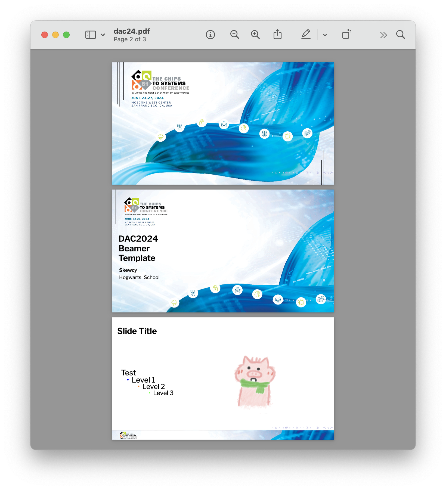

## Unofficial beamer template for Design Automation Conference (DAC) 2024

### Preview:

### Acknowledgement:

I basically followed this blog step by step:

https://ctroupin.github.io/posts/2020-03-19-ppt2beamer/

### Known issues:

- Require to **compile twice** to get the correct title page layout
- Require **XeLaTeX** for the third-party fonts (Libre Franklin) to work properly
- This is an **unofficial** template, use at your own risk
